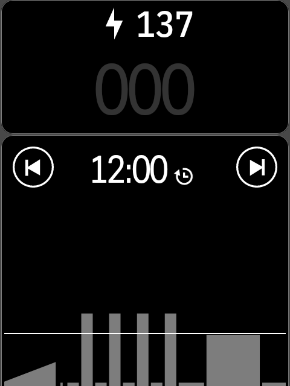

# Workout+

[](LICENSE)
[](https://github.com/angkyria/karoo-workout-plus/actions/workflows/build.yml)


**Website: [angkyria.github.io/karoo-workout-plus](https://angkyria.github.io/karoo-workout-plus/)**

The new Karoo OS workout layout, as a free, open-source extension for the
**Hammerhead Karoo 2**. The Karoo 3 got a purple workout drawer — target bar,
interval countdown, workout progress — while the Karoo 2 kept its old workout
page. Workout+ **replaces the workout page** with the new layout while a workout
runs; your other ride pages work as usual.

Built on the official [karoo-ext](https://github.com/hammerheadnav/karoo-ext)
extension API, in the style of [Climber+](https://github.com/hazzus/karoo-climber-plus).
No system modification.

| The workout page | Two fields removed | The Karoo 2 workout page it covers |
|---|---|---|
|  |  |  |

The Workout+ pictures are drawn by the app's own drawing code on every push to
`main` (`RenderTest`), at the Karoo 2's 480 × 800 with its font. More layouts —
drawer, chip, no fields, a finished workout — are on the
[website](https://angkyria.github.io/karoo-workout-plus/).

## What you get

- **Primary target**, native look: icon + `POWER` / `HEART RATE`, the target
  range with the target glyph, and a bar whose middle third is the range. The
  value box slides along it: **green** in range, **blue ▲** below, **red ▼**
  above. Tap it to switch to the numeric style.
- **Ramps** (warm-ups, ramp tests) hold you to the ramp's *current* value, not
  the whole 137–187 W span, and are drawn as slopes in the graph.
- **Secondary target** (power / HR / cadence) as a compact row.
- **Interval and workout in one block**: `INTERVAL 3 OF 9` with the workout's
  time left (and its scale when it isn't 100 %) on top, a huge interval
  countdown (amber in the last 5 s, `PAUSED` beside it while the ride is
  paused), the interval's progress bar and the **interval graph**: intervals
  already ridden at their real length, colored by your power / HR zones, the
  current one outlined, the rest of the workout hatched.
- **Core heat** with a [CORE](https://corebodytemp.com) sensor: a row with core
  temperature, the Heat Strain Index and skin temperature, as big as the data
  fields, in CORE's heat-zone colors.
  The index, heat zone, training load and adaptation come from the
  [CORE Heat](https://github.com/angkyria/karoo-core) extension when it's installed.
- **Up to four data fields** of your choice (3s power, HR, cadence, NP, TSS,
  lap power, workout time left, core / skin temperature, heat strain, …) plus
  Workout+'s own **time in range** for the interval and the workout. Set a
  field to **None** to remove it: the rest of the page grows (an odd field out
  spans the whole row; with no fields the target and the clock get it all).

Ranges follow Karoo OS: single-value targets get the implied band (power ±5 %,
heart rate ±7.5 %), and in/out of range is judged on the rounded numbers you
see, so the color never contradicts the digits. Your power (heart rate,
cadence) comes from the Karoo's workout output, or straight from the sensor
when the workout output has none. The target shows even when the power meter
isn't connected (the output then reads `--`).

### Gestures and buttons

| Action | How |
|---|---|
| Change ride page | the top buttons, or swipe left/right — leaving the workout page shows your page |
| Minimize to the chip | on other pages: tap the **handle** at the top, or swipe down. The workout page always stays covered |
| Bring the layout back | tap the chip, or come back to the workout page |
| Visual ↔ numeric target | tap the target |

Workout+ never takes the hardware buttons: page changes, lap and back keep
their native Karoo actions.

## Page modes (settings)

| Mode | Behavior |
|---|---|
| **Replace the workout page** (default) | the layout covers the workout page; the other pages work as usual, with a chip |
| Cover every page | the layout covers every ride page while a workout runs |
| Chip + drawer only | Climber+-style: chip → drawer → full page by hand |

The workout page is recognized from the ride page's data fields, which
karoo-ext reports (on the Karoo 2 the native workout page is a single
`TYPE_WORKOUT_ID` element), or by the **Workout+ page** data field you can add
to any page of your own.

## Installation

1. Download the APK from the [releases page](../../releases), or the latest
   build of any branch from its [Build run](../../actions/workflows/build.yml)
   (artifact `karoo-workout-plus-debug`), or build it, see below.
2. Enable Developer Options + USB debugging on the Karoo
   ([Hammerhead guide](https://support.hammerhead.io/hc/en-us/articles/30696553134363)).
3. Install and allow the overlay:
   ```sh
   adb install -r karoo-workout-plus.apk
   adb shell appops set com.angkyria.karooworkout SYSTEM_ALERT_WINDOW allow
   ```
   (or open **Workout+** on the Karoo and tap **Grant** for *draw over other apps*).

Turn on **Demo mode** in the settings to see the layout without a ride or trainer.
An APK signed with another key (the earlier debug test builds, or a CI build over
your own) installs only after `adb uninstall com.angkyria.karooworkout`.

## Building

Requires JDK 17 and the Android SDK (platform 34). `karoo-ext` resolves via JitPack.

```sh
./gradlew assembleDebug        # app/build/outputs/apk/debug/karoo-workout-plus-debug.apk
./gradlew testDebugUnitTest    # engine, stream parsing, page takeover, formatting,
                               # and RenderTest: every layout to app/build/screenshots
```

CI (GitHub Actions) does the same on every push: `build.yml` runs the tests and
attaches the debug APK and the rendered layouts to the run; `pages.yml`
publishes the [website](https://angkyria.github.io/karoo-workout-plus/) from
`site/` with those renders on every push to `main`.

Release builds are signed with a local `keystore.properties` (see
`app/build.gradle.kts`; not committed). Tag `vX.Y.Z` to have CI publish a
release (`.github/workflows/release.yml`).

## How it works

- Workout data comes from the karoo-ext workout streams: interval count and
  index, interval / workout time remaining, primary and secondary target (with
  and without output), and the per-kind power / HR / cadence target streams
  (which tell target kinds apart, carry the workout scale, and keep the target
  available without a sensor). The power / HR / cadence sensor streams back up
  the workout output.
- karoo-ext exposes the *running* workout only — not the interval list — so the
  interval graph is built as you ride; time is counted from the interval
  countdown itself, so pauses never count.
- `ActiveRidePage` reports the visible ride page. When a ride starts with a
  workout, the Karoo 2 jumps to its workout page without reporting it — Workout+
  covers it straight away.
- The overlay is a `TYPE_APPLICATION_OVERLAY` window hosted by the extension's
  foreground service (the Ki2 / Climber+ pattern), drawn on a plain `Canvas` and
  repainted only when a visible digit changes — Karoo 2 battery matters. It
  leaves the ride app's header (ride time, battery, clock) visible.

### Limitations

- karoo-ext has no workout controls: skip / rewind interval and the workout
  scale stay on the Karoo's own controls (Workout+ shows their effect). It can
  only pause the whole ride, not the workout, so Workout+ has no pause button.
- Upcoming intervals are unknown until ridden (hatched in the graph).
- The layout shows while a ride is recording or paused, not before the start.
- Workout stream units and enum codes are undocumented; the settings screen has a
  **diagnostics** panel showing exactly what your Karoo streams.

## Credits

- [karoo-ext](https://github.com/hammerheadnav/karoo-ext) by Hammerhead (Apache-2.0)
- [Climber+](https://github.com/hazzus/karoo-climber-plus) by hazzus (Apache-2.0) —
  project structure and overlay window pattern
- [CORE Heat](https://github.com/angkyria/karoo-core) (Apache-2.0) — heat zones,
  adaptation levels and colors; its data streams
- Overlay window pattern originally from [Ki2](https://github.com/valterc/ki2) by valterc
- Glyphs from [Material Symbols](https://github.com/google/material-design-icons) (Apache-2.0)

## Disclaimer

Not affiliated with, endorsed by, or supported by Hammerhead or SRAM. Use at your
own risk; keep your eyes on the road.

## License

[Apache License 2.0](LICENSE)
